# QA

Details on how to use the automated assessment protocol are [here](http://preprocessed-connectomes-project.github.io/quality-assessment-protocol/)

## The Phenotypic File
Here we detail the quality assessment (QA) columns given in the phenotypic file ([download here](https://s3.amazonaws.com/fcp-indi/data/Projects/ABIDE_Initiative/Phenotypic_V1_0b_preprocessed1.csv)). There are automated metrics provided with columns having the prefix `anat_` or `func_`. There are also manual quality assessment of the data by three raters with columns having the prefix `qc_`.

## Automated QA

These columns reflect automated metrics with descriptions given further down. To determine outliers one might use 1.5x or 3x the inter-quartile range (IQR). Here, we provide a list of the columns for automated anatomical or functional quality assessment. 

**Anatomical**

* anat_cnr
* anat_efc
* anat_fber
* anat_fwhm
* anat_qi1
* anat_snr

**Functional**

* func_efc
* func_fber
* func_fwhm
* func_dvars
* func_outlier
* func_quality
* func_mean_fd
* func_num_fd
* func_perc_fd
* func_gsr

### Anatomical

For each point below, we will describe a given measure via the following format: "Measure - Column: Summary"

* **Contrast to Noise Ratio [anat_cnr]:** Calculated as the mean of the gray matter values minus the mean of the white matter values, divided by the standard deviation of the air values [^1].
* **Entopy Focus Criterion [anat_efc]:** Shannon’s entropy is used to summarize the principal directions distribution, higher energy indicating the distribution is more uniform (i.e., less noisy) [^2].
* **Foreground to Background Energy Ratio [anat_fber]:** Mean energy of image values (i.e., mean of squares) within the head relative to outside the head.
* **Smoothness of Voxels [anat_fwhm]:** The full-width half maximum (FWHM) of the spatial distribution of the image intensity values in terms of voxels (e.g., a value of 3 implies smoothness of 3 voxels) [^3].
* **Percent of Artifact Voxels [anat_qi1]:** The proportion of voxels with intensity corrupted by artifacts normalized by the number of voxels in the background [^4].
* **Signal to Noise Ratio [anat_snr]:** The mean of image values within gray matter divided by the standard deviation of the image values within air (i.e., outside the head) [^1].

Below we show the results of the anatomical QA measures for all the ABIDE subjects.

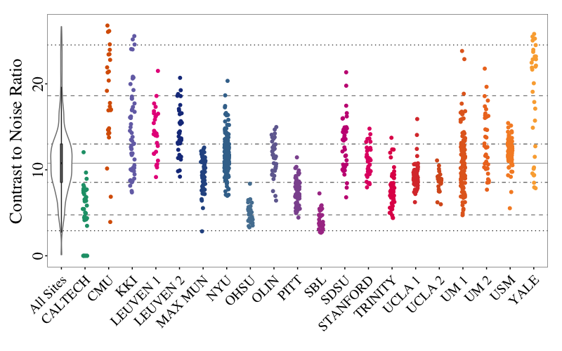

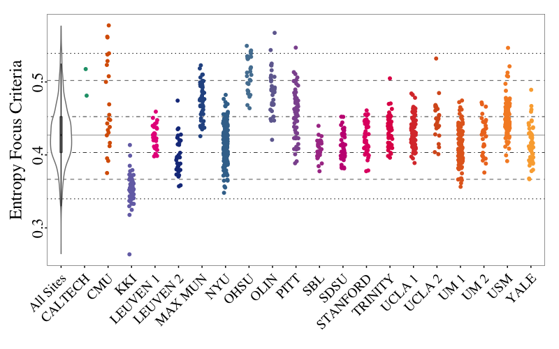

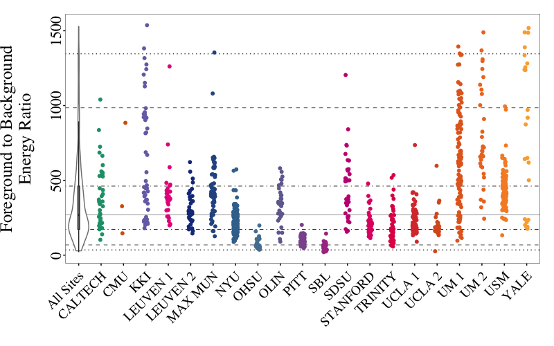

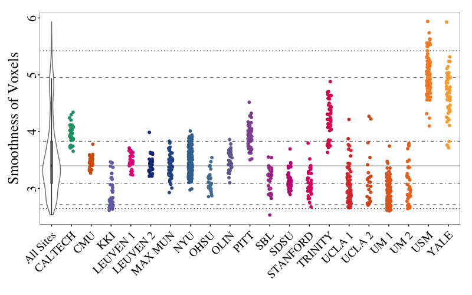

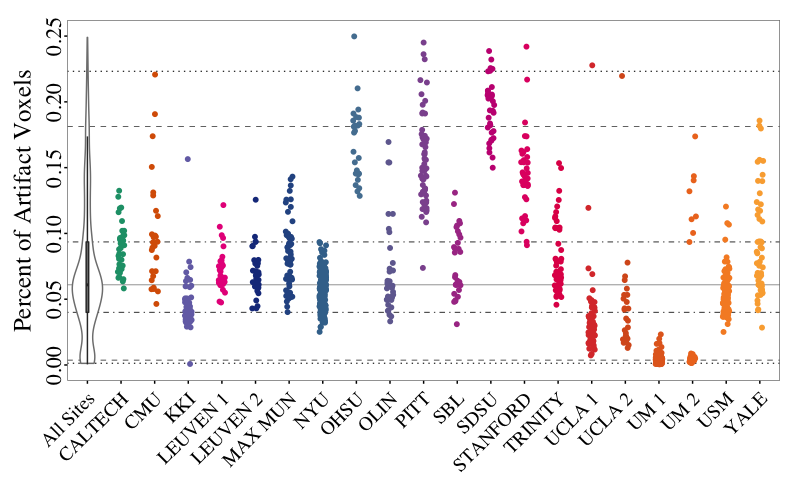

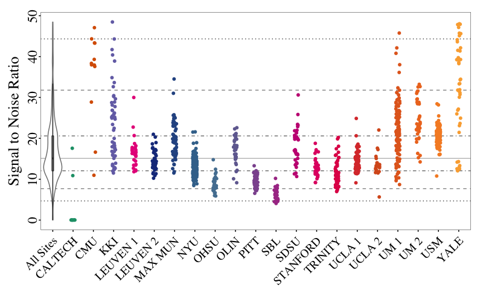

### Functional

Note that some metrics quantify the quality of the data in the spatial domain (columns: func_efc, func_fber, func_fwhm, and func_gsr) and use the mean functional image for this purpose. Other metrics quantify the quality of the data in the temporal domain (columns: func_dvars, func_outlier, func_quality, func_mean_fd, func_num_fd, and func_perc_fd) and use the voxelwise time-series functional data.

* **Entopy Focus Criterion [func_efc]:** Shannon’s entropy is used to summarize the principal directions distribution, higher energy indicating the distribution is more uniform (i.e., less noisy) [^2]. _Uses mean functional._
* **Foreground to Background Energy Ratio [func_fber]:** Mean energy of image values (i.e., mean of squares) within the head relative to outside the head. _Uses mean functional._
* **Smoothness of Voxels [func_fwhm]:** The full-width half maximum (FWHM) of the spatial distribution of the image intensity values. _Uses mean functional._
* **Standardized DVARS [func_dvars]:** The spatial standard deviation of the temporal derivative of the data, normalized by the temporal standard deviation and temporal autocorrelation [^5][^6]. _Uses functional time-series._
* **Fraction of Outlier Voxels [func_outlier]:** The mean fraction of outliers found in each volume using 3dTout command in AFNI (http://afni.nimh.nih.gov/afni) [^7]. _Uses functional time-series._
* **Mean Distance to Median Volume [func_quality]:** The mean distance (1 – spearman’s rho) between each time-point's volume and the median volume using AFNI’s 3dTqual command (http://afni.nimh.nih.gov/afni) [^7]. _Uses functional time-series._
* **Mean Framewise Displacement (FD) [func_mean_fd]:** A measure of subject head motion, which compares the motion between the current and previous volumes. This is calculated by summing the absolute value of displacement changes in the x, y and z directions and rotational changes about those three axes. The rotational changes are given distance values based on the changes across the surface of a 50mm radius sphere [^5][^8]. _Uses functional time-series._
* **Number FD greater than 0.2mm [func_num_fd]:** The number of frames or volumes with displacement greater than 0.2mm. This is not shown below. _Uses functional time-series._
* **Percent FD greater than 0.2mm [func_perc_fd]:** The percent of frames or volumes with displacement greater than 0.2mm. _Uses functional time-series._
* **Ghost to Signal Ratio [func_gsr]:** A measure of the mean signal in the ‘ghost’ image (signal present outside the brain due to acquisition in the phase encoding direction) relative to mean signal within the brain. _Uses mean functional._

Below we show the results of the functional QA measures for all the ABIDE subjects. We exclude the number of voxels with FD > 0.2mm and only show the percent of voxels with FD > 0.2mm.

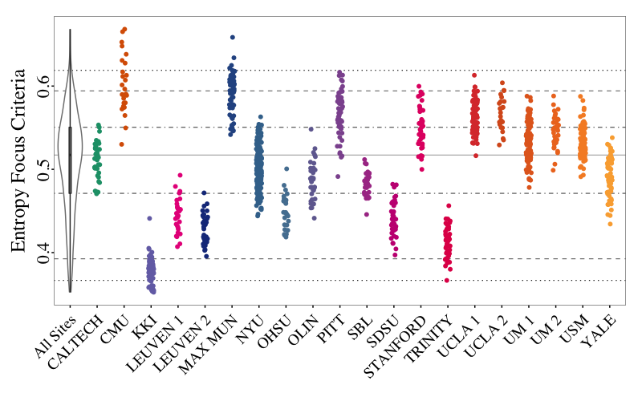

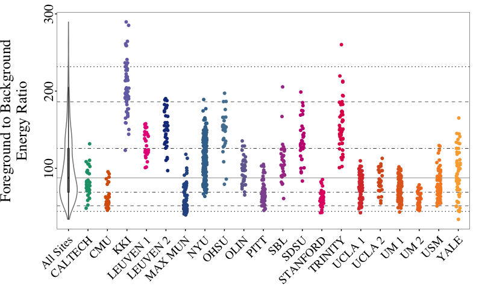

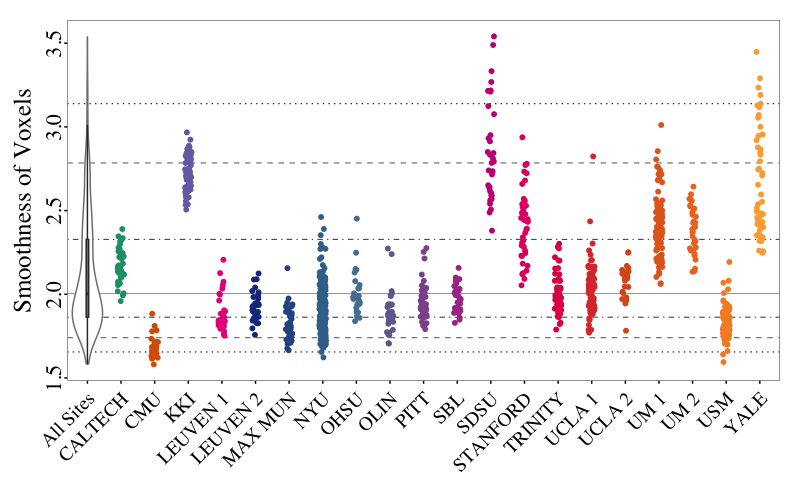

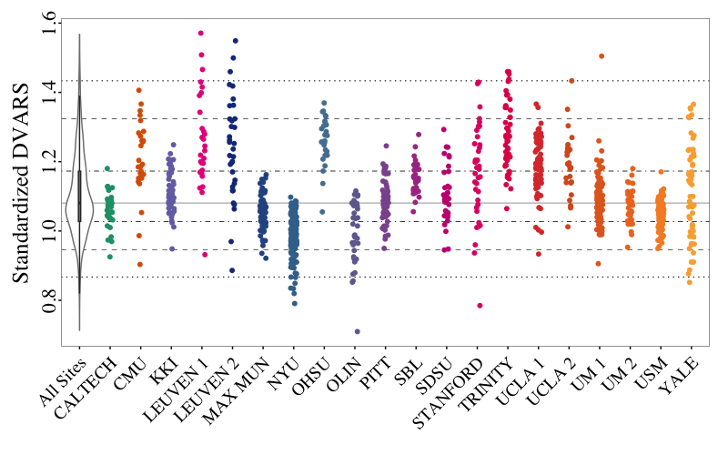

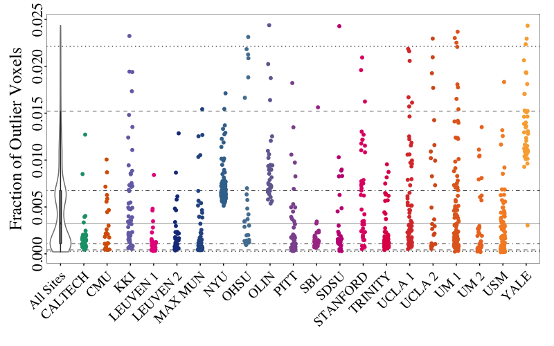

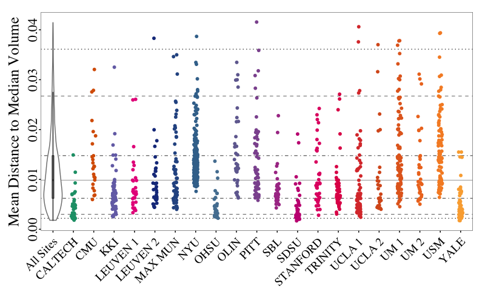

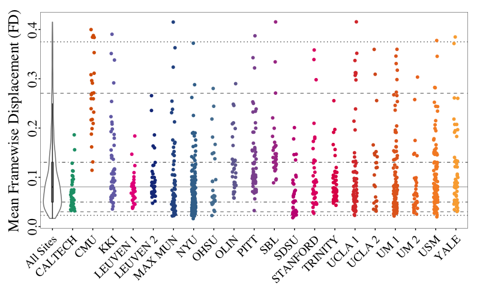

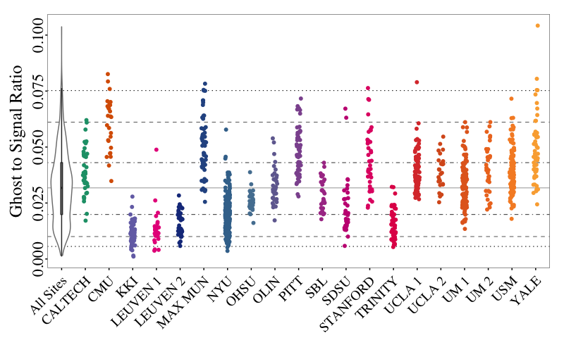

## Manual QA

Manual inspection of the data was carried out by three independent raters. Rater 1 examined the general quality of the data focusing on the preprocessed functional data and derivatives. Raters 2-3 examined the quality of the raw anatomical and functional data. Ratings are given as OK and fail for raters 1 and 3, and OK, maybe, and fail for rater 2. Each rater also may have taken notes related to their ratings, thus there is a notes column associated with each rating column.

## References

[^1]: Magnotta, V. A., & Friedman, L. (2006). Measurement of signal-to-noise and contrast-to-noise in the fBIRN multicenter imaging study. Journal of Digital Imaging, 19(2), 140-147.

[^2]: Farzinfar, M., Dietrich, C., Smith, R. G., Li, Y., Gupta, A., Liu, Z., & Styner, M. A. (2012, May). Entropy based DTI quality control via regional orientation distribution. In Biomedical Imaging (ISBI), 2012 9th IEEE International Symposium on (pp. 22-25). IEEE.

[^3]: Friedman, L., Stern, H., Brown, G. G., Mathalon, D. H., Turner, J., Glover, G. H., ... & Potkin, S. G. (2008). Test–retest and between‐site reliability in a multicenter fMRI study. Human brain mapping, 29(8), 958-972.

[^4]: Mortamet, B., Bernstein, M. A., Jack, C. R., Gunter, J. L., Ward, C., Britson, P. J., ... & Krueger, G. (2009). Automatic quality assessment in structural brain magnetic resonance imaging. Magnetic Resonance in Medicine, 62(2), 365-372.

[^5]: Power, J. D., Barnes, K. A., Snyder, A. Z., Schlaggar, B. L. & Petersen, S. E. Spurious but systematic correlations in functional connectivity MRI networks arise from subject motion. Neuroimage 59, 2142-2154 (2012).

[^6]: Nichols, T. (2012, Oct 28). Standardizing DVARS. Retrieved from http://blogs.warwick.ac.uk/nichols/entry/standardizing_dvars.

[^7]: Cox, R.W.. AFNI: Software for analysis and visualization of functional magnetic resonance neuroimages. Computers and Biomedical Research, 29:162-173, 1996.

[^8]: Jenkinson, M., Bannister, P., Brady, M., & Smith, S. (2002). Improved optimization for the robust and accurate linear registration and motion correction of brain images. Neuroimage, 17(2), 825-841.

[^9]: Giannelli, M., Diciotti, S., Tessa, C., & Mascalchi, M. (2010). Characterization of Nyquist ghost in EPI-fMRI acquisition sequences implemented on two clinical 1.5 T MR scanner systems: effect of readout bandwidth and echo spacing. Journal of Applied Clinical Medical Physics, 11(4).
